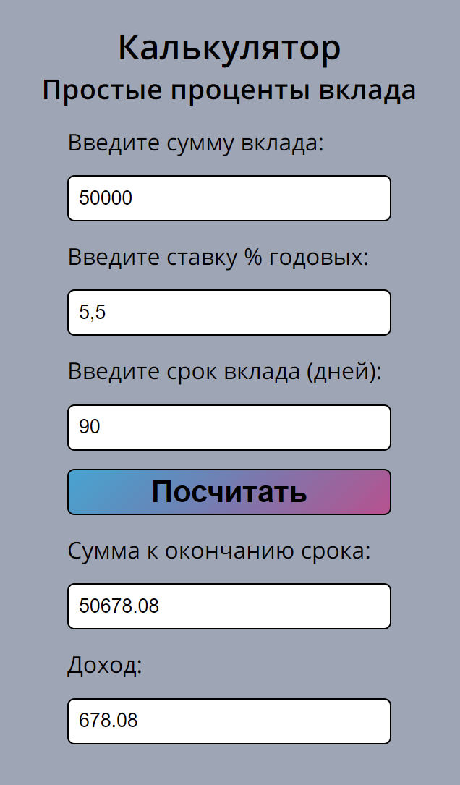

# Калькулятор простого вклада

## Выполняет расчет простого вклада
На вход принимает общую сумму вклада, ставку годовых и срок вклада.
На выходе сумма дохода и общая сумма вклада по кончанию срока.

